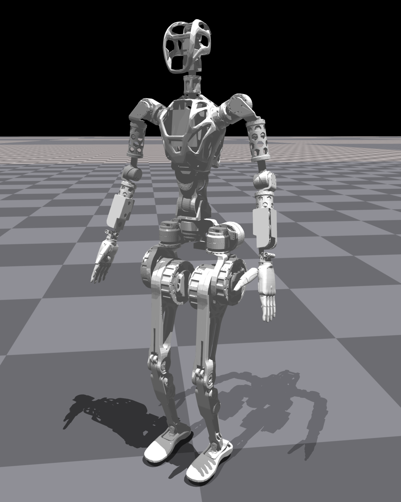

# Fourier Intelligence GRx in Isaac Gym Environment



This repository provides an environment used to train GRx to walk on rough terrain using NVIDIA's Isaac Gym, legged_gym and rsl_rl libraries from Legged Robotics @ ETH Zürich.

### Useful Links

* NVIDIA Isaac Gym: https://developer.nvidia.com/isaac-gym
* legged_gym: https://github.com/leggedrobotics/legged_gym.git
* rsl_rl: https://github.com/leggedrobotics/rsl_rl.git

### Installation

0. Install Ubuntu 20.04:
    - The suggest version is Ubuntu 20.04, because Isaac Gym recommends running on Ubuntu 20.04.
    - Official Website：https://releases.ubuntu.com/focal/
    - Installation Guidance：https://ubuntu.com/tutorials/install-ubuntu-desktop#1-overview

1. Install Nvidia Driver:
    - Install Nvidia driver using the Software & Updates application that comes with Ubuntu 20.04.
    - Make sure you can see the GPU information and CUDA information by using the command line `nvidia-smi` in the terminal. As shown in the example below:

```
              +-----------------------------------------------------------------------------+
              | NVIDIA-SMI 525.125.06   Driver Version: 525.125.06   CUDA Version: 12.0     |
              |-------------------------------+----------------------+----------------------+
              | GPU  Name        Persistence-M| Bus-Id        Disp.A | Volatile Uncorr. ECC |
              | Fan  Temp  Perf  Pwr:Usage/Cap|         Memory-Usage | GPU-Util  Compute M. |
              |                               |                      |               MIG M. |
              |===============================+======================+======================|
              |   0  NVIDIA GeForce ...  Off  | 00000000:01:00.0  On |                  Off |
              |  0%   42C    P8    25W / 450W |    709MiB / 24564MiB |      1%      Default |
              |                               |                      |                  N/A |
              +-------------------------------+----------------------+----------------------+
                                                                                    
              +-----------------------------------------------------------------------------+
              | Processes:                                                                  |
              |  GPU   GI   CI        PID   Type   Process name                  GPU Memory |
              |        ID   ID                                                   Usage      |
              |=============================================================================|
              |    0   N/A  N/A      1032      G   /usr/lib/xorg/Xorg                 53MiB |
              |    0   N/A  N/A      1666      G   /usr/lib/xorg/Xorg                239MiB |
              |    0   N/A  N/A      1805      G   /usr/bin/gnome-shell              125MiB |
              |    0   N/A  N/A      2171      G   /usr/lib/firefox/firefox          205MiB |
              |    0   N/A  N/A      2847      G   ...RendererForSitePerProcess       45MiB |
              |    0   N/A  N/A      3721      G   ...RendererForSitePerProcess       20MiB |
              +-----------------------------------------------------------------------------+
```

3. Install Anaconda:
    - Official Website: https://www.anaconda.com/products/distribution
    - Installation: https://www.anaconda.com/download/

4. Create conda environment `wiki-grx-gym`:
    ```
    conda create -n wiki-grx-gym python=3.11
    conda activate wiki-grx-gym
    ```

5. Install Isaac Gym:
    ```
    cd ./IsaacGym_Preview_4_Package/isaacgym/python/
    pip install -e .
    ```

6. Install rsl_rl:
    ```
    cd ./rsl_rl
    pip install -e .
    ```

7. Install legged_gym:
    ```
    cd ./legged_gym
    pip install -e .
    ```

8. Install other dependencies:
    ```
   # Some functions use old variable types, so numpy version greater than 1.24 will report an error
    pip install numpy==1.20.0
    ```

9. Start training:
    ```
    cd legged_gym/legged_gym/scripts
    python ./train.py --task=GR1T1 --headless
    ```

---

## Notice

The training code here only controls the robot legs to walk, and the robot body is fixed.
If you want to control the robot body to move, you need to modify the following files:

- urdf file: `./legged-gym/legged_gym/resources/robots/gr1t1/urdf/GR1T1.urdf`
- config file: `./legged-gym/legged_gym/envs/gr1t1/gr1t1_config.py`

---

Thank you for your interest in the Fourier Intelligence GRx Robot Model Repository.
We hope you find this resource helpful in your robotics projects!