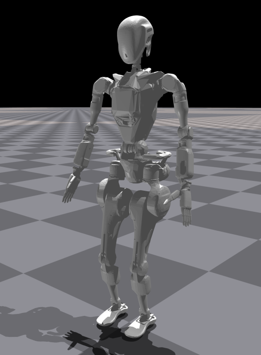

# Wiki-GRx-Gym




This repository provides an environment used to train GRx to walk on rough terrain using NVIDIA's Isaac Gym, legged_gym and rsl_rl libraries from Legged Robotics @ ETH Zürich.

### Useful Links

* NVIDIA Isaac Gym: https://developer.nvidia.com/isaac-gym
* legged_gym: https://github.com/leggedrobotics/legged_gym.git
* rsl_rl: https://github.com/leggedrobotics/rsl_rl.git

### Installation

0. Install Ubuntu 20.04 / 22.04:
    - The suggest version is Ubuntu 20.04, but can also run on Ubuntu 22.04.
    - Official Website：https://releases.ubuntu.com/focal/
    - Installation Guidance：https://ubuntu.com/tutorials/install-ubuntu-desktop#1-overview

1. Install Nvidia Driver:
    - Install Nvidia driver using the Software & Updates application that comes with Ubuntu 20.04 / 22.04.
    - Make sure you can see the GPU information and CUDA information by using the command line `nvidia-smi` in the terminal. As shown in the example below:

```
+-----------------------------------------------------------------------------+
| NVIDIA-SMI 525.125.06   Driver Version: 525.125.06   CUDA Version: 12.0     |
|-------------------------------+----------------------+----------------------+
| GPU  Name        Persistence-M| Bus-Id        Disp.A | Volatile Uncorr. ECC |
| Fan  Temp  Perf  Pwr:Usage/Cap|         Memory-Usage | GPU-Util  Compute M. |
|                               |                      |               MIG M. |
|===============================+======================+======================|
|   0  NVIDIA GeForce ...  Off  | 00000000:01:00.0  On |                  Off |
|  0%   42C    P8    25W / 450W |    709MiB / 24564MiB |      1%      Default |
|                               |                      |                  N/A |
+-------------------------------+----------------------+----------------------+
                                                                      
+-----------------------------------------------------------------------------+
| Processes:                                                                  |
|  GPU   GI   CI        PID   Type   Process name                  GPU Memory |
|        ID   ID                                                   Usage      |
|=============================================================================|
|    0   N/A  N/A      1032      G   /usr/lib/xorg/Xorg                 53MiB |
|    0   N/A  N/A      1666      G   /usr/lib/xorg/Xorg                239MiB |
|    0   N/A  N/A      1805      G   /usr/bin/gnome-shell              125MiB |
|    0   N/A  N/A      2171      G   /usr/lib/firefox/firefox          205MiB |
|    0   N/A  N/A      2847      G   ...RendererForSitePerProcess       45MiB |
|    0   N/A  N/A      3721      G   ...RendererForSitePerProcess       20MiB |
+-----------------------------------------------------------------------------+
```

2. Conda Environment Setup:

    1. Install Miniconda:
        ```
        cd $HOME/Downloads
         
        wget https://repo.anaconda.com/miniconda/Miniconda3-latest-Linux-x86_64.sh
        bash Miniconda3-latest-Linux-x86_64.sh
        ```

    2. Create conda environment `grx-gym`:
       ```
       conda create -n grx-gym python=3.8
       conda activate grx-gym
       ```

    3. Install conda environment dependencies:
       ```
       # Install isaacgym
       cd path/to/your/workspace
       
       cd ./IsaacGym_Preview_4_Package/isaacgym/python/
       pip install -e . -i https://mirrors.tuna.tsinghua.edu.cn/pypi/web/simple
       
       # Install rsl_rl
       cd path/to/your/workspace
       
       cd ./rsl_rl
       pip install -e . -i https://mirrors.tuna.tsinghua.edu.cn/pypi/web/simple
       
       # Install legged_gym
       cd path/to/your/workspace
       
       cd ./legged_gym
       pip install -e . -i https://mirrors.tuna.tsinghua.edu.cn/pypi/web/simple
       ```

    4. Install other dependencies:
       ```
       # Some functions use old variable types, so numpy version greater than 1.24 will report an error
       pip install numpy==1.20.0
         
       # tensorboard is needed for display the training process
       pip install tensorboard
       pip install protobuf==3.20.3
       ```

3. Training:

```
cd legged_gym/legged_gym/scripts
python ./train.py --task=XXX --headless
(XXX is the task name, such as GR1T1, GR1T2, etc.)
```

4. Playing:

```
cd legged_gym/legged_gym/scripts
python ./play.py --task=XXX --num_envs=25
(XXX is the task name, such as GR1T1, GR1T2, etc.)
```

---

Thank you for your interest in the Fourier Intelligence GRx Robot Model Repository.
We hope you find this resource helpful in your robotics projects!